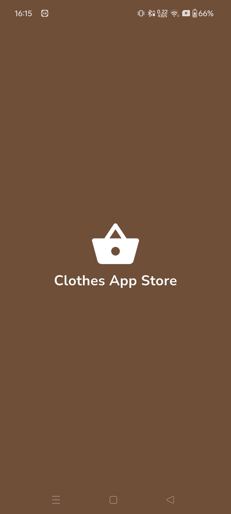
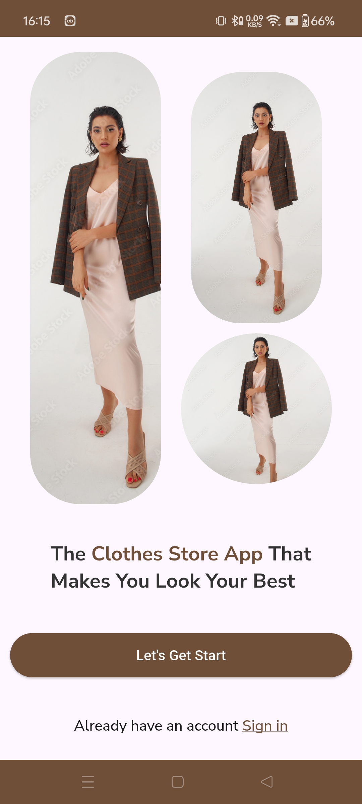
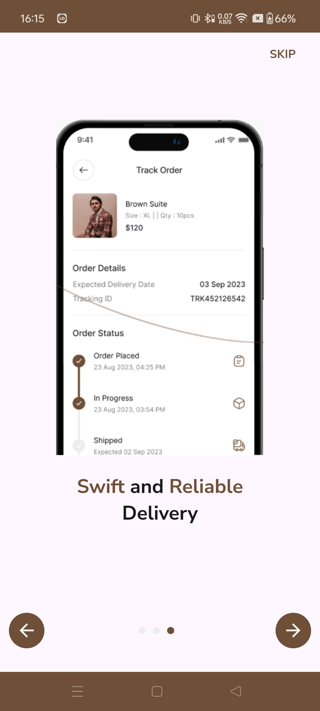
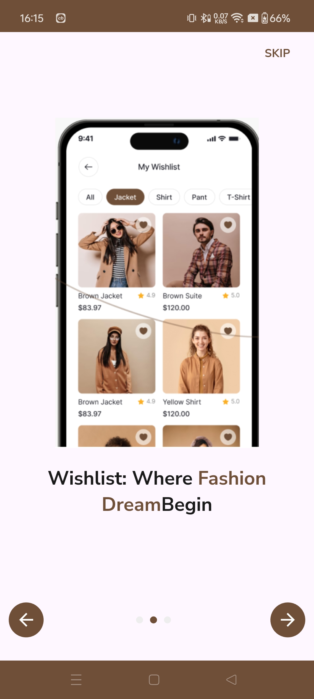
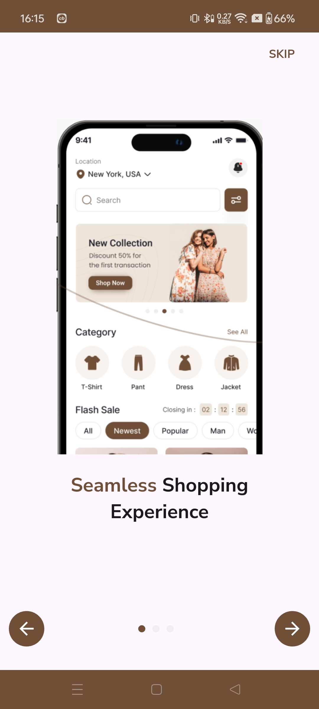
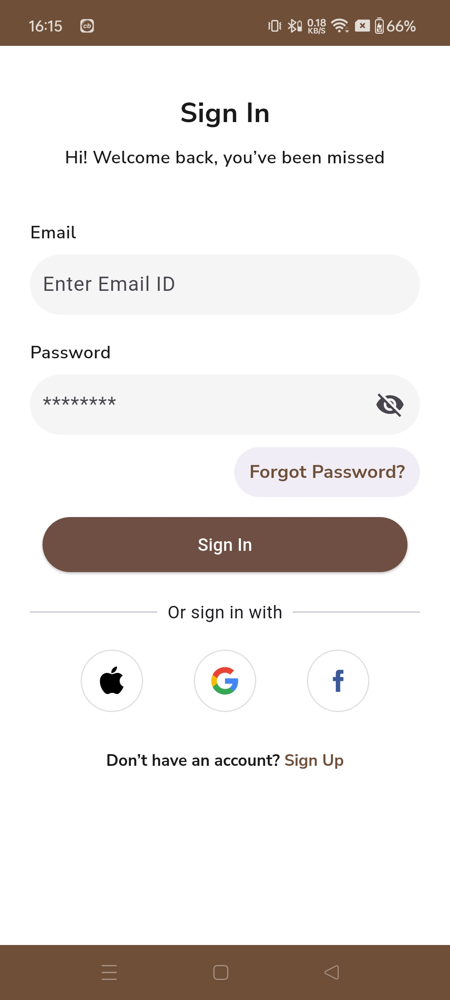
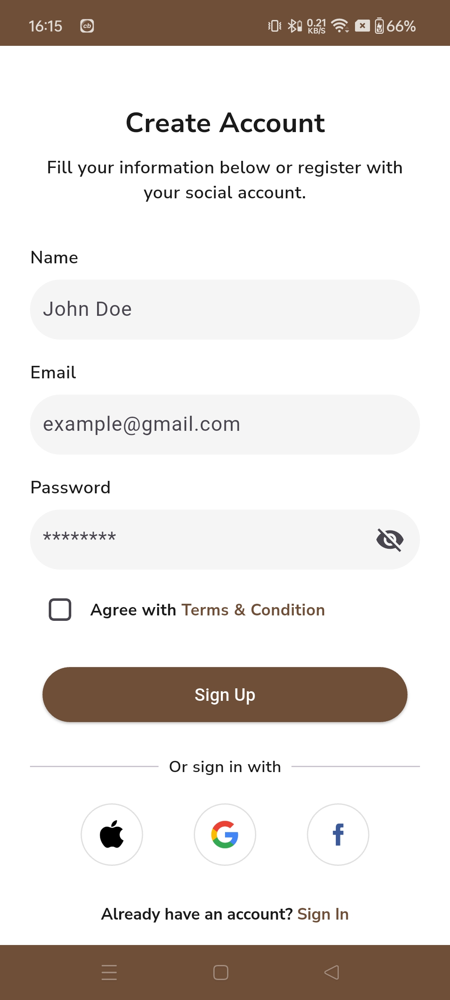
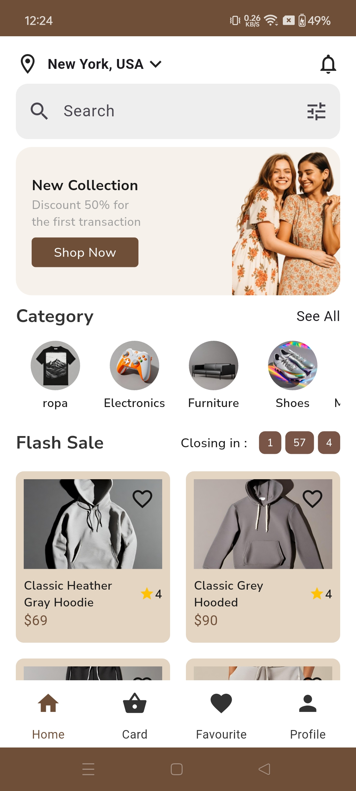

<!DOCTYPE html>
<html lang="en">
<head>
  <meta charset="UTF-8" />
  <meta name="viewport" content="width=device-width, initial-scale=1.0"/>
  
</head>
<body>

  <h1>👕 Clothing Store App (Flutter + MVVM + GetX)</h1>

  

    A simple, clean Flutter app following the <strong>MVVM architecture</strong> using <strong>GetX</strong>.  
    This app demonstrates how to manage state, organize code, and build scalable mobile apps.
    It features a basic clothing store with a product list.
  

  

    <h2>🖼️ Screenshots</h2>
    

      
      
      
      
      
      
      
      
    

  

  

    <h2>✨ Features</h2>
    <ul>
      <li>🔄 MVVM architecture</li>
      <li>📦 GetX for state management and dependency injection</li>
      <li>🧩 Modular folder structure</li>
      <li>🧪 Easy to scale and test</li>
      <li>🧵 Example: Clothing store product list</li>
    </ul>
  

  

    <h2>🗂️ Folder Structure</h2>
    

      # clothes_store_app 
      └── clothes_store_app
    

  

</body>
</html>
